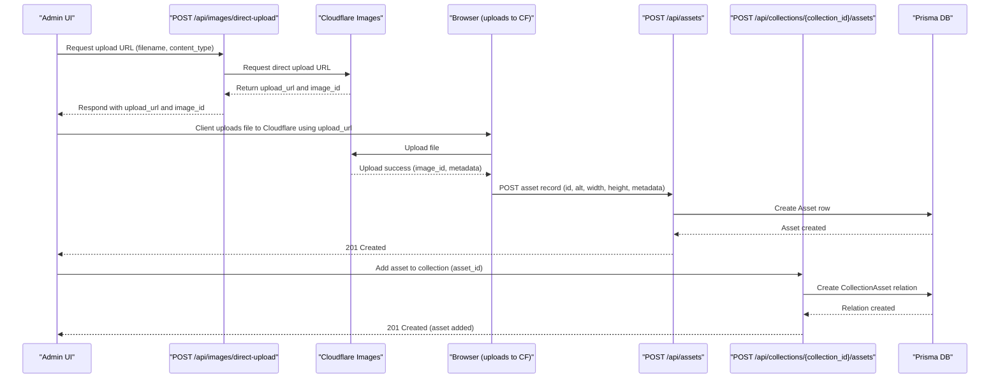
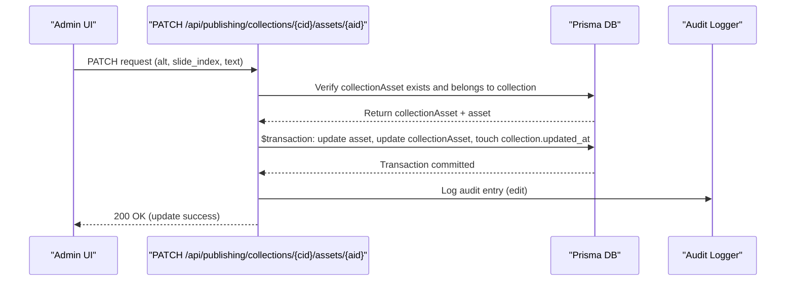
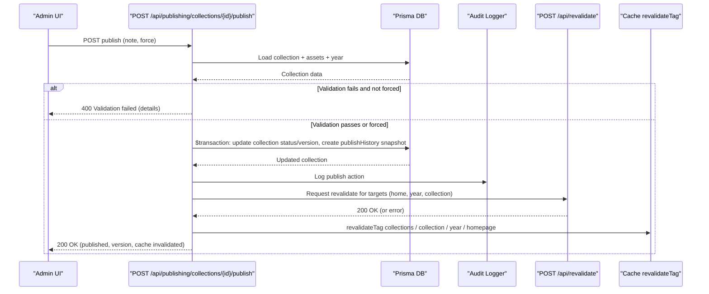
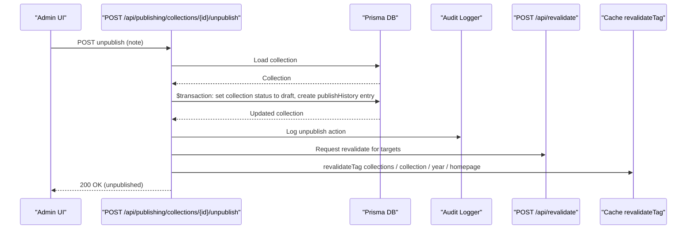
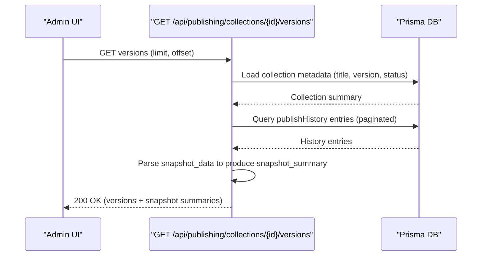

# 詳細架構說明（修正版：Mermaid 相容性調整）

已修正 Mermaid 語法以相容 mermaid 11.6.0：
- 移除內含反引號/內嵌程式碼與不必要的分號
- 將程式式標記改為簡短可解析的文字標籤
- 保留圖的語意，但改寫成穩定的 Mermaid 表示法

---

## 逐檔摘要（略，請參考 ARCHITECTURE.md）

（此檔重點放在修正後的 Mermaid 圖）

---

## 低階 sequence diagrams（修正版）

1) Direct-upload → Create Asset → Add to Collection

2) Asset update inside collection (PATCH) — atomic update + audit

3) Publish flow (detailed)

4) Unpublish (detailed)

5) Versions listing (GET) — server-side snapshot parsing

---

## 中階與高階圖（保留原意，已移除可能導致解析錯誤的字元）
若需我將這些 Mermaid 圖渲染為 SVG 檔（單一合併圖或多個圖檔），請授權我在 Act mode 下執行 mermaid CLI。我會先列出即將執行的命令供你確認。
