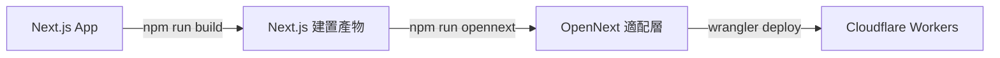

# Cloudflare 部署完整指南

## 📌 重要提醒

您的專案使用 **Cloudflare Workers** (不是 Cloudflare Pages),需要特定的建置流程。

---

## 🚀 部署方式選擇

### 方式一: GitHub Actions 自動部署 (推薦)

✅ **優點**: 完全自動化,配置正確,每次 push 到 `main` 分支自動部署

您已經有 `.github/workflows/deploy-staging.yml`,這是正確的部署方式!

#### 部署流程:
1. Push 代碼到 `main` 分支
2. GitHub Actions 自動執行:
   - `npm ci` - 安裝依賴
   - `npx @opennextjs/cloudflare@latest build` - 建置 OpenNext
   - `npx @opennextjs/cloudflare@latest deploy -e staging` - 部署到 Cloudflare Workers

#### 檢查部署狀態:
- 前往 GitHub Repository > Actions 標籤頁
- 查看最新的 workflow 執行記錄
- 確認所有步驟都成功 ✅

---

### 方式二: 本地手動部署

如果需要本地部署到 production:

```bash
# 1. 確保已安裝依賴
npm ci

# 2. 建置 Next.js
npm run build

# 3. 建置 OpenNext (生成 Cloudflare Workers 適配層)
npm run opennext

# 4. 部署到 production
npm run deploy:production
```

或使用一鍵命令:
```bash
npm run deploy:production
```

---

## ⚠️ 常見錯誤與解決方案

### 問題 1: 照片無法顯示 (404)

**原因**: 圖片路由 `/images/[id]/[variant]` 沒有正確部署

**解決方案**:

#### 如果使用 GitHub Actions:
1. 檢查 `.github/workflows/deploy-staging.yml` 中的建置命令:
   ```yaml
   - name: Build (OpenNext for Cloudflare)
     run: npx @opennextjs/cloudflare@latest build
   ```

2. 確認使用的是 `@opennextjs/cloudflare` 而不是普通的 `open-next`

3. 重新觸發部署:
   ```bash
   git commit --allow-empty -m "Trigger rebuild"
   git push
   ```

#### 如果手動部署:
1. 確保執行完整的建置流程:
   ```bash
   npm run opennext
   wrangler deploy --env production
   ```

2. **不要**直接執行 `wrangler deploy`,必須先執行 `npm run opennext`

---

### 問題 2: R2 Bucket 圖片無法訪問

**檢查清單**:

1. **確認 R2 綁定配置** (`wrangler.toml`):
   ```toml
   [[env.production.r2_buckets]]
   binding = "UPLOADS"
   bucket_name = "utoa-photography-assets"
   ```

2. **確認圖片已上傳到 R2**:
   ```bash
   npx wrangler r2 object list utoa-photography-assets --env production
   ```

3. **確認圖片路徑格式正確**:
   - 應該是: `images/{id}/{variant}.webp`
   - 例如: `images/abc123/medium.webp`

4. **測試圖片路由**:
   ```bash
   curl -I https://utoa.studio/images/YOUR_IMAGE_ID/medium
   ```
   應該返回 `200 OK` 而不是 `404`

---

### 問題 3: Cloudflare Dashboard 手動連接 GitHub

⚠️ **如果您在 Cloudflare Dashboard 手動設置了 GitHub 連接,請停用它!**

**原因**: Cloudflare Pages 的自動建置可能使用錯誤的命令

**正確做法**:
1. 移除 Cloudflare Dashboard 中的 GitHub 連接
2. 只使用 GitHub Actions 進行部署
3. 在 GitHub 設置以下 secrets:
   - `CLOUDFLARE_ACCOUNT_ID`
   - `CLOUDFLARE_API_TOKEN`
   - `DATABASE_URL` (如果需要)

---

## 🔧 正確的建置流程

### Next.js → OpenNext → Cloudflare Workers



### 關鍵檔案:

1. **`.open-next/worker.js`** - Cloudflare Worker 入口點
2. **`.open-next/server-functions/default/index.mjs`** - Next.js server handler
3. **`.open-next/assets/`** - 靜態資源 (CSS, JS, images)

### 驗證建置:

```bash
# 檢查 .open-next 目錄
ls -la .open-next/

# 應該看到:
# - worker.js
# - server-functions/
# - assets/
# - middleware/
```

---

## 📊 部署後檢查清單

- [ ] GitHub Actions workflow 執行成功
- [ ] Cloudflare Workers 部署成功
- [ ] 首頁正常載入 (https://utoa.studio)
- [ ] 照片集頁面正常顯示
- [ ] 照片圖片正常載入 (不是 404)
- [ ] Admin 後台正常訪問
- [ ] 圖片上傳功能正常

---

## 🐛 除錯技巧

### 1. 查看 Cloudflare Workers 日誌:

```bash
npx wrangler tail --env production
```

然後訪問您的網站,查看即時日誌輸出。

### 2. 檢查圖片路由:

```bash
# 測試圖片路由是否正確回應
curl -v https://utoa.studio/images/test/medium
```

### 3. 檢查 R2 Bucket:

```bash
# 列出所有圖片
npx wrangler r2 object list utoa-photography-assets --env production

# 檢查特定圖片
npx wrangler r2 object get utoa-photography-assets images/YOUR_ID/medium.webp
```

### 4. 本地測試 Worker:

```bash
# 在本地運行 Cloudflare Worker
npm run dev:worker

# 訪問 http://localhost:8787
```

---

## 🔄 更新部署

### 方式一: 自動部署 (推薦)
```bash
git add .
git commit -m "Update: 修復照片顯示問題"
git push origin main
```

### 方式二: 手動部署
```bash
npm run deploy:production
```

---

## 📞 需要幫助?

如果照片仍然無法顯示:

1. **檢查 GitHub Actions 日誌** - 確認建置過程沒有錯誤
2. **檢查 Cloudflare Workers 日誌** - 查看是否有請求錯誤
3. **驗證 R2 綁定** - 確認 `UPLOADS` binding 正確配置
4. **測試圖片路由** - 手動訪問 `/images/YOUR_ID/medium`

---

## 🎯 快速修復步驟

如果您的照片現在無法顯示,執行以下步驟:

```bash
# 1. 確保本地建置正確
npm run build
npm run opennext

# 2. 檢查 .open-next 目錄是否正確生成
ls -la .open-next/

# 3. 重新部署
npm run deploy:production

# 或者觸發 GitHub Actions 重新部署
git commit --allow-empty -m "Rebuild: 修復圖片路由"
git push origin main
```

---

## ✅ 驗證部署成功

部署完成後,執行以下測試:

```bash
# 1. 測試首頁
curl -I https://utoa.studio/

# 2. 測試 API
curl -I https://utoa.studio/api/years

# 3. 測試圖片路由 (替換成您的實際圖片 ID)
curl -I https://utoa.studio/images/YOUR_IMAGE_ID/medium

# 4. 測試靜態資源
curl -I https://utoa.studio/_next/static/css/...
```

所有請求都應該返回 `200 OK` 或 `301/302` 重定向,而不是 `404`。
